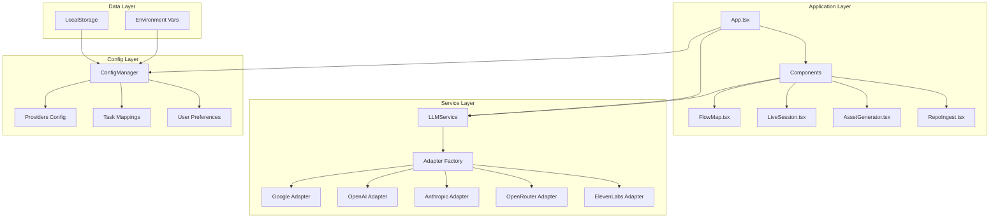
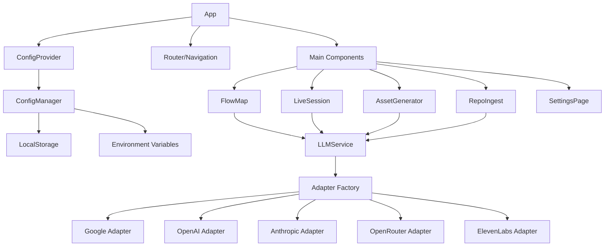
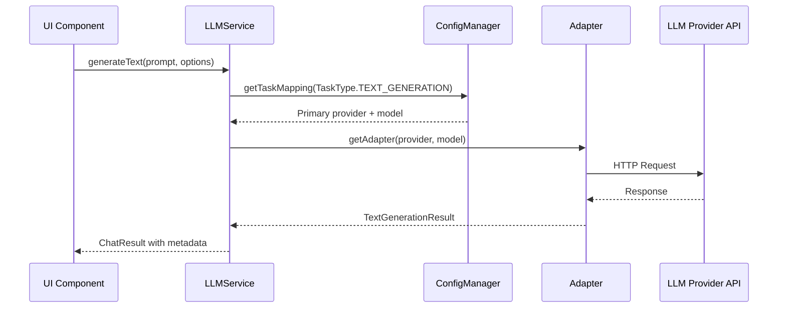
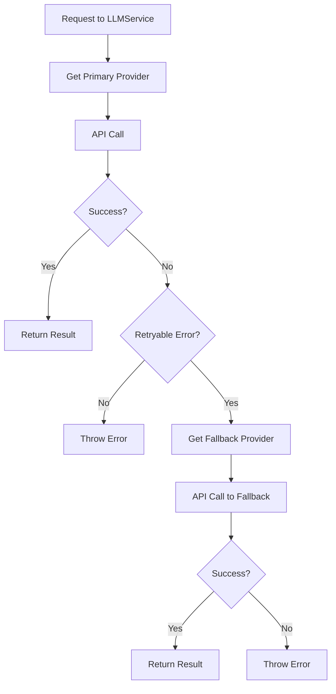
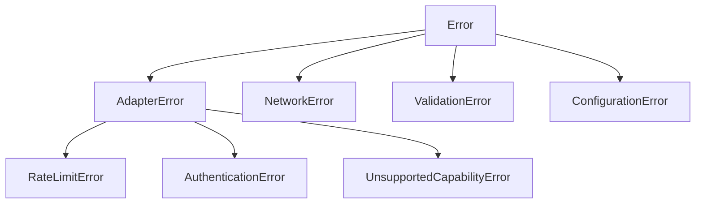
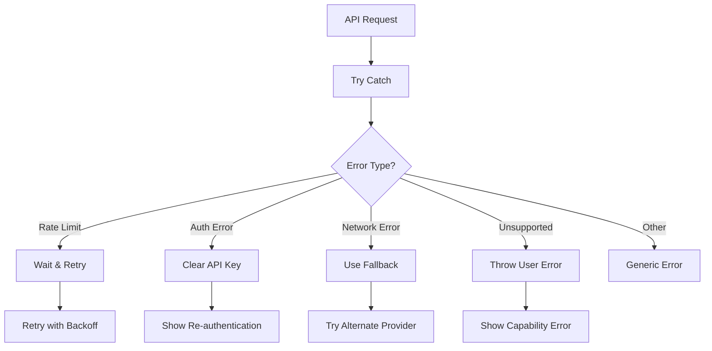

# 🏗️ Architecture Documentation

This document provides a comprehensive overview of the Codebase Cartographer architecture, including component hierarchy, data flow, and design patterns.

## Table of Contents

- [Architecture Overview](#architecture-overview)
- [Component Hierarchy](#component-hierarchy)
- [Adapter Pattern Implementation](#adapter-pattern-implementation)
- [Data Flow Diagrams](#data-flow-diagrams)
- [Configuration Management](#configuration-management)
- [Service Layer Architecture](#service-layer-architecture)
- [Error Handling Strategy](#error-handling-strategy)

## Architecture Overview

Codebase Cartographer follows a **modular, service-oriented architecture** that enables multi-provider LLM support while maintaining clean separation of concerns. The system is built around several key principles:

- **Adapter Pattern**: Unified interface for multiple LLM providers
- **Service Layer**: Business logic separated from UI components
- **Configuration Management**: Persistent, flexible provider and task mappings
- **Graceful Degradation**: Automatic fallback between providers
- **Type Safety**: Comprehensive TypeScript definitions

### Core Components



## Component Hierarchy

### Main Application Structure

```
Codebase Cartographer/
├── App.tsx                    # Root application component
├── index.tsx                  # Entry point with ConfigProvider
├── types.ts                   # Global TypeScript types
├── constants.ts               # Application constants and prompts
├── components/
│   ├── FlowMap.tsx           # D3.js architecture visualization
│   ├── LiveSession.tsx       # Real-time voice chat component
│   ├── AssetGenerator.tsx    # Video generation UI
│   └── RepoIngest.tsx        # Codebase file ingestion
└── src/
    ├── components/
    │   ├── SetupWizard.tsx   # First-run configuration
    │   ├── SettingsPage.tsx  # Settings management
    │   └── CapabilityMatrix.tsx # Visual capability display
    ├── config/
    │   ├── configManager.ts  # Configuration persistence
    │   └── providers.ts      # Provider definitions
    ├── hooks/
    │   ├── useConfig.tsx     # Configuration context hook
    │   └── useFeatureAvailability.ts # Feature availability check
    ├── services/
    │   ├── llmService.ts     # Unified service layer
    │   └── adapters/         # Provider-specific adapters
    │       ├── base.ts       # Base adapter interface
    │       ├── google.ts     # Google Gemini adapter
    │       ├── openai.ts     # OpenAI adapter
    │       ├── anthropic.ts  # Anthropic adapter
    │       ├── openrouter.ts # OpenRouter adapter
    │       └── elevenlabs.ts # ElevenLabs adapter
    ├── types/
    │   └── capabilities.ts   # Type definitions
    └── utils/
        ├── apiKeyValidator.ts # API key validation
        └── capabilityMatrix.ts # Task-provider matching
```

### Component Relationships



## Adapter Pattern Implementation

The adapter pattern is the core architectural pattern that enables multi-provider support. It provides a unified interface while allowing provider-specific implementations.

### Base Adapter Interface

```typescript
abstract class BaseLLMAdapter {
  abstract readonly providerId: ProviderId;
  abstract readonly name: string;

  // Common interface methods
  abstract generateText(prompt: string, options?: TextGenerationOptions): Promise<TextGenerationResult>;
  abstract generateStructuredOutput<T>(prompt: string, schema: object, options?: StructuredOutputOptions): Promise<T>;
  abstract supportsCapability(capability: string): boolean;
  abstract getModelForTask(taskType: TaskType): string | null;

  // Optional capabilities with default implementations
  async generateSpeech(text: string, options?: TTSOptions): Promise<TTSResult> {
    throw new UnsupportedCapabilityError(this.providerId, 'tts');
  }

  async generateVideo(prompt: string, options?: VideoGenerationOptions): Promise<VideoResult> {
    throw new UnsupportedCapabilityError(this.providerId, 'video');
  }
}
```

### Adapter Factory Pattern

```typescript
function createAdapter(providerId: ProviderId, apiKey: string, modelId?: string): BaseLLMAdapter {
  switch (providerId) {
    case 'google':
      return new GoogleAdapter(apiKey, modelId);
    case 'openai':
      return new OpenAIAdapter(apiKey, modelId);
    case 'anthropic':
      return new AnthropicAdapter(apiKey, modelId);
    case 'openrouter':
      return new OpenRouterAdapter(apiKey, modelId);
    case 'elevenlabs':
      return new ElevenLabsAdapter(apiKey, modelId);
    default:
      throw new Error(`Unsupported provider: ${providerId}`);
  }
}
```

### Provider-Specific Adapters

Each adapter implements the base interface with provider-specific implementations:

#### Google Adapter
- Uses Google Generative AI SDK
- Supports: Text, Vision, TTS, Video, Real-time Voice, Thinking, Search
- API endpoint: `https://generativelanguage.googleapis.com/v1beta`

#### OpenAI Adapter
- Uses OpenAI Node.js SDK
- Supports: Text, Vision, TTS, Real-time Voice
- API endpoint: `https://api.openai.com/v1`

#### Anthropic Adapter
- Uses Anthropic Node.js SDK
- Supports: Text, Vision, Thinking
- API endpoint: `https://api.anthropic.com`

## Data Flow Diagrams

### Request Flow: Text Generation



### Configuration Flow

```mermaid
flowchart TD
    A[User Input] --> B[Settings UI]
    B --> C{Validation}
    C -->|Valid| D[ConfigManager.setProviderKey()]
    C -->|Invalid| E[Show Error]
    D --> F[Obfuscate Key]
    F --> G[Save to LocalStorage]
    G --> H[Notify Subscribers]
    H --> I[Update UI]

    J[Environment Variables] --> K[ConfigManager]
    K --> L[Auto-detect Providers]
    L --> M[Set Default Mappings]
```

### Fallback Logic Flow



## Configuration Management

The configuration system provides persistent storage and flexible provider/task mappings.

### Configuration Hierarchy

```mermaid
graph LR
    A[ConfigManager] --> B[Providers]
    A --> C[Task Mappings]
    A --> D[User Preferences]

    B --> E[ProviderConfig]
    E --> F[API Key (obfuscated)]
    E --> G[Enabled/Disabled]
    E --> H[Validation Status]

    C --> I[TaskProviderMapping]
    I --> J[Primary Provider]
    I --> K[Fallback Provider]
    I --> L[Model Selections]

    D --> M[Model Tier Preference]
    D --> N[Cost vs Speed]
    D --> O[UI Preferences]
```

### Configuration Sources

1. **Environment Variables** (Highest Priority)
   - VITE_GOOGLE_API_KEY
   - VITE_OPENAI_API_KEY
   - VITE_ANTHROPIC_API_KEY
   - VITE_OPENROUTER_API_KEY

2. **User Settings** (Interactive Configuration)
   - API Key entry via UI
   - Task/provider mappings
   - User preferences

3. **Local Storage** (Persistent)
   - Obfuscated API keys
   - User preferences
   - Task mappings

4. **Defaults** (Fallback)
   - Default model selections
   - Default task mappings
   - Default preferences

## Service Layer Architecture

The LLMService acts as the central orchestrator, handling request routing and provider selection.

### Service Responsibilities

1. **Adapter Management**
   - Create and cache adapters
   - Handle adapter lifecycle
   - Clear cache on configuration changes

2. **Provider Resolution**
   - Determine best provider for task
   - Handle fallback logic
   - Validate capability availability

3. **Request Orchestration**
   - Route requests to appropriate adapters
   - Handle retries and errors
   - Aggregate results and metadata

4. **Feature Availability**
   - Check which features are enabled
   - Provide capability checks
   - Handle graceful degradation

### Service Methods

```typescript
class LLMService {
  // Core methods
  generateText(prompt: string, options?: TextGenerationOptions): Promise<TextGenerationResult>
  generateStructuredOutput<T>(prompt: string, schema: object, options?: StructuredOutputOptions): Promise<T>

  // Specialized methods
  generateSpeech(text: string, options?: TTSOptions): Promise<TTSResult>
  generateVideo(prompt: string, options?: VideoGenerationOptions): Promise<VideoResult>
  connectRealtime(config: RealtimeConfig): Promise<RealtimeConnection>

  // Utility methods
  isTaskAvailable(taskType: TaskType): boolean
  getFeatureAvailability(): FeatureAvailability
  clearCache(): void
}
```

## Error Handling Strategy

The system implements a comprehensive error handling strategy with proper error types and fallback mechanisms.

### Error Type Hierarchy



### Error Handling Flow



### Retry Logic

1. **Rate Limiting**: Wait and retry with exponential backoff
2. **Temporary Failures**: Retry with delay
3. **Permanent Failures**: Switch to fallback provider
4. **No Fallback Available**: Propagate error to user

### Error Recovery

- **Automatic Recovery**: Rate limits, temporary network issues
- **User Intervention Required**: Authentication errors, invalid API keys
- **Graceful Degradation**: Feature unavailable errors

## Performance Considerations

### Caching Strategy

1. **Adapter Cache**: Reuse adapter instances for same provider/model
2. **Response Cache**: Cache expensive operations (video generation)
3. **Configuration Cache**: Cache frequently accessed config values

### Memory Management

1. **Adapter Lifecycle**: Clear cache when configuration changes
2. **Event Listeners**: Clean up on component unmount
3. **Large Data**: Stream video/audio instead of loading entirely

### Network Optimization

1. **Request Batching**: Combine multiple requests when possible
2. **Compression**: Compress large requests/responses
3. **Connection Pooling**: Reuse HTTP connections

## Security Considerations

### API Key Management

1. **Obfuscation**: Basic obfuscation for localStorage (not encryption)
2. **Environment Variables**: Preferred storage method
3. **Key Rotation**: Support for rotating keys without reconfiguration

### Input Validation

1. **Sanitization**: Validate all user inputs
2. **Schema Validation**: JSON schema for structured outputs
3. **Size Limits**: Limit request sizes to prevent abuse

### CORS and Content Security

1. **CORS**: Configured for specific API endpoints only
2. **Content Security**: Restrict resource loading
3. **HTTPS**: Enforced for all API communications

---

This architecture provides a solid foundation for multi-provider LLM support while maintaining clean separation of concerns and extensibility for future providers.